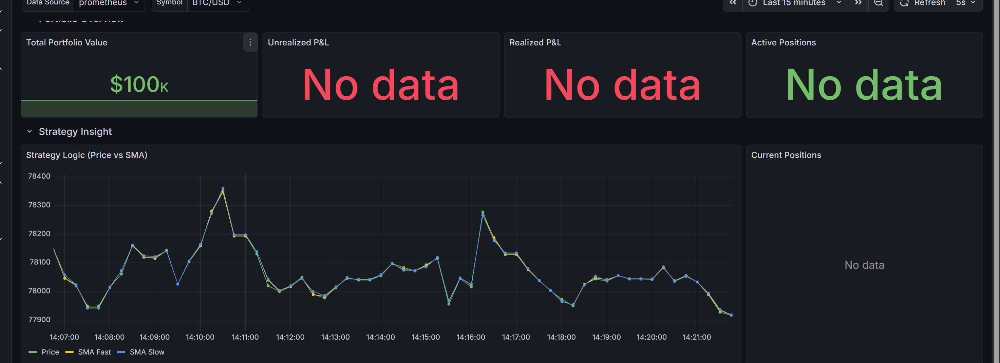

# GammaTrade



GammaTrade is a high-performance algorithmic trading platform designed for hybrid execution using Python for strategy generation and C++ for low-latency execution routing.

## 🚀 Key Features

- **Multi-Asset Support**: Architecture supports crypto and equity markets.
- **Hybrid Core**:
  - **Python Strategy Engine**: Leverages the rich ecosystem of Python data science libraries (Pandas, NumPy) for signal generation.
  - **C++ Execution Router**: Ultra-low latency trade routing and risk management.
- **Microservices Architecture**: Containerized components communicating via Redis Pub/Sub.
- **Real-time Monitoring**: Integrated dashboards for system health and P&L tracking.

## 📂 System Components

- **`m_ingestion`**: Market Data Ingestion services.
- **`o_ingestion`**: Order/Account state ingestion.
- **`processing/strategy_engine`**: Alpha generation logic.
- **`processing/execution_router`**: Order routing and validation.
- **`execution/`**: Exchange-specific execution adapters.
- **`monitoring`**: Grafana/Prometheus configurations.

## 🛠️ Quick Start

Refer to [SETUP.md](SETUP.md) for detailed installation instructions.

```bash
# Run the full stack
docker-compose up --build
```
